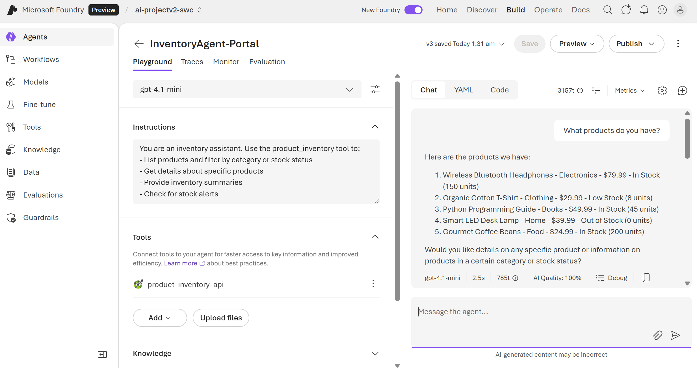

# Azure AI Foundry Agent Service: OpenAPI tool
This repo demonstrates how to use an *OpenAPI-specified API* as a tool for an AI agent in the **Azure AI Foundry Agent Service**. The solution includes a mock FastAPI backend with API key authentication that the agent can query for product inventory data.

The provided Jupyter notebook, `Agent_OpenAPITool.ipynb`, shows the complete end-to-end setup: from testing the backend API to creating and interacting with the agent.

> [!Note]
> The API key is securely stored in an Azure Ai Foundry's project connection and passed automatically by the Agent Service.

## 📑 Table of Contents:
- [Part 1: Configuring the Environment](#part-1-configuring-the-environment)
- [Part 2: Backend API Implementation](#part-2-backend-api-implementation)
- [Part 3: Agent Configuration and Execution](#part-3-agent-configuration-and-execution)

## Part 1: Configuring the Environment

### 1.1. Prerequisites
You need:
- An *Azure AI Foundry* project with a deployed AI model (e.g., gpt-4.1),
- Authorisation to deploy backend API endpoint as a Web site to Azure App Services.

### 1.2. Environment Variables
The Jupyter notebook uses the following variables:

| Variable                         | Description                                        |
| -------------------------------- | -------------------------------------------------- |
| `AZURE_FOUNDRY_PROJECT_ENDPOINT` | Your Azure AI Foundry project endpoint URL         |
| `AZURE_FOUNDRY_GPT_MODEL`        | Deployed AI model name (e.g., gpt-4.1)             |
| `OPENAPI_CONNECTION_NAME`        | Name of the project connection storing the API key |

### 1.3. Required Libraries
Install the necessary Python packages:

``` PowerShell
pip install azure-ai-projects azure-identity jsonref requests
```

## Part 2: Backend API Implementation

### 2.1. Deploying an Azure Web app
Switch to `app` directory and run the following Azure CLI commands.

1. Login to Azure:

``` PowerShell
	az login
```

2. Deploy backend API solution to an existing App Service Plan (so, that you can manage its cost):

``` PowerShell
   az webapp up --name <WEB_APP_NAME> --resource-group <AZURE_RESOURCE_GROUP> --plan <AZURE_APP_SERVICE_PLAN> --location <AZURE_REGION> --runtime "PYTHON:3.11"
```

3. Set startup command for FastAPI:

``` PowerShell
   az webapp config set --name <WEB_APP_NAME> --resource-group <AZURE_RESOURCE_GROUP> --startup-file "gunicorn -w 4 -k uvicorn.workers.UvicornWorker product_inventory_api:app"
```

The backend API should become available at `http://<WEB_APP_NAME>`, with interactive docs accessible at `http://<WEB_APP_NAME>/docs` as shown below.


> [!IMPORTANT]
> Backend API accepts the following API Key: `test-api-key-12345`

### 2.2. API Endpoints
The backend provides read-only access to mock product inventory:

| Endpoint                         | Description                                          |
| -------------------------------- | ---------------------------------------------------- |
| `GET /products`                  | List all products (filter by category, stock_status) |
| `GET /products/{product_id}`     | Get specific product details                         |
| `GET /inventory/summary`         | Get inventory totals and statistics                  |
| `GET /inventory/alerts`          | Get low stock and out of stock items                 |

### 2.3. Testing the API
You can test connectivity to backend APIs with the following curl commands.

1. Health check (no auth):

``` PowerShell
curl http://<WEB_APP_NAME>/
```

2. List products (**requires API key**):

``` PowerShell
curl -H "x-api-key: test-api-key-12345" http://<WEB_APP_NAME>/products
```

3. Get inventory summary (**requires API key**):

``` PowerShell
curl -H "x-api-key: test-api-key-12345" http://<WEB_APP_NAME>/inventory/summary
```

## Part 3: Agent Configuration and Execution

### 1.2. Project Connection for API Key
Create a project connection in Azure AI Foundry to store the API key:
1. Go to **Management Center** → **Connected Resources** → **Add Connection**
2. Select **Custom Keys** type
3. Configure:
   - **Name**: `product-inventory-api`
   - **Key**: `x-api-key`
   - **Value**: `test-api-key-12345`

### 3.1. OpenAPI Specification
The `product_inventory_openapi.json` file defines the API schema for the agent. Key requirements:
- Every operation has an `operationId` (e.g., `listProducts`, `getProduct`)
- Security scheme defines API key authentication via `x-api-key` header
- Descriptive summaries help the LLM choose the correct operation

### 3.2. Defining the Tool
The OpenAPI tool is configured with project connection authentication:
```python
openapi_tool = {
    "type": "openapi",
    "openapi": {
        "name": "product_inventory",
        "description": "Query product inventory data, check stock levels, and get alerts.",
        "spec": openapi_spec,
        "auth": {
            "type": "project_connection",
            "security_scheme": {
                "project_connection_id": connection_id
            }
        },
    }
}
```

### 3.3. Agent Creation
```python
agent = project_client.agents.create_version(
    agent_name="InventoryAgent",
    definition=PromptAgentDefinition(
        model="gpt-4o",
        instructions="You are an inventory assistant...",
        tools=[openapi_tool],
    ),
)
```

### 3.4. Sample Interactions
Once created, you can use Agents Playground to ask the agent questions like:

``` JSON
- "What products do you have?"
- "Show me the inventory summary."
- "Are there any stock alerts?"
- "Tell me about product PROD-001."
- "What electronics do you have?"
```

The agent will use the OpenAPI tool to call the appropriate endpoint and return the results similar to this.


